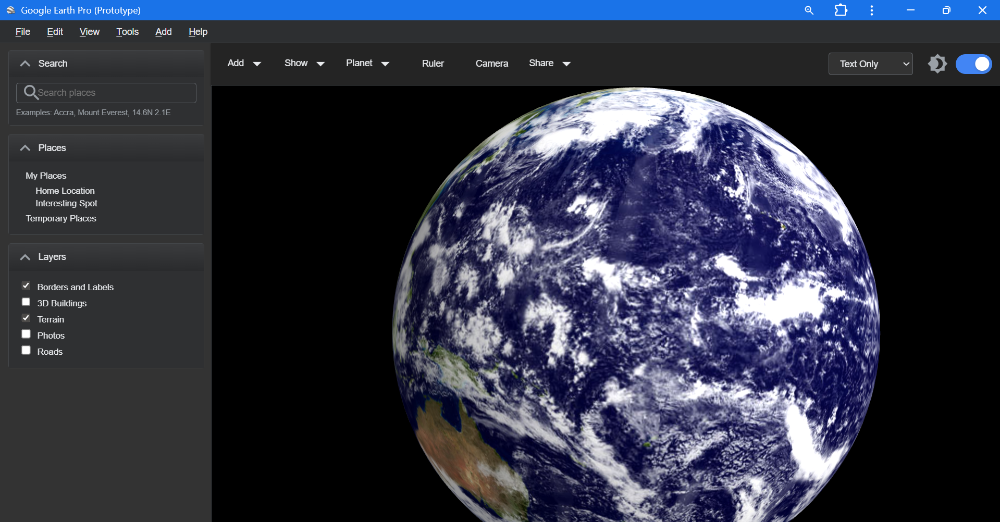
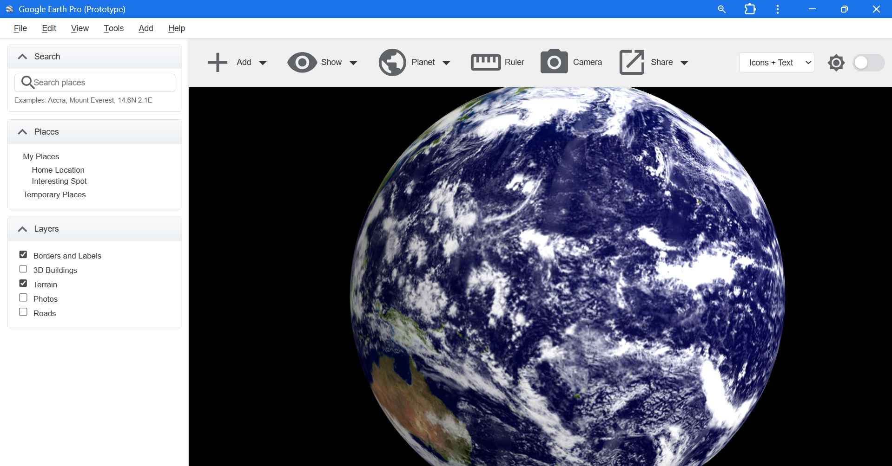
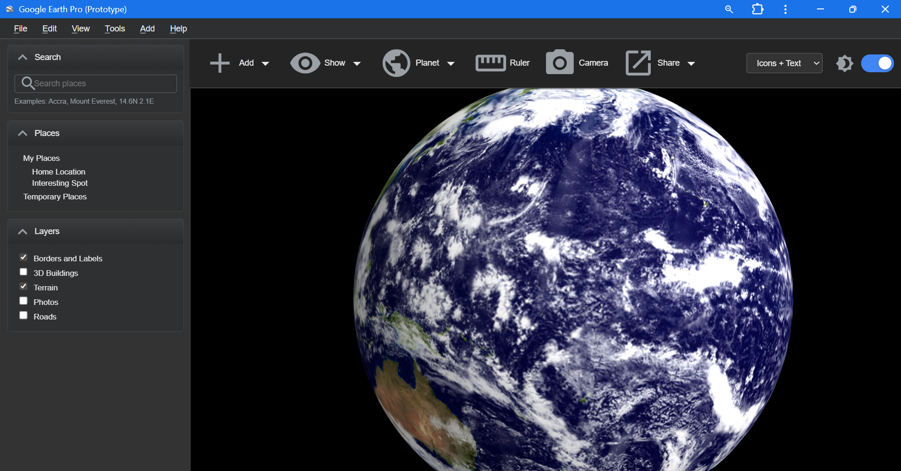

  <h1>Google Earth Pro (Prototype)

> Educational prototype (not an official product). Trademarks belong to their owners.

---

## 1. Overview
A streamlined UI experiment to organize Google Earth Pro's UI: 

**Demo Video:**

---
## 2. Tech Stack
- React · Vite · CSS Modules + CSS Variables 
- Material UI Icons 
- Three.js 
- Service Worker (PWA)---

## 3. Core Features
- **Larger, Grouped Toolbar**: Better button sizing and logical clustering for improved usability
- **Dark/Light Theming**: Instant theme switching via CSS variables across all surfaces
- **Responsive Display Modes**: Icons Only / Text Only / Icons + Text with automatic compaction
- **Resizable Side Panel**: Collapsible sections with drag-to-resize functionality
- **PWA Ready**: Service worker caching + manifest for offline capability
- **Interactive Globe**: Three.js rendering with fallback textures

---

## 4. Screenshots

   

---

## 6. Credits
- Original Google Earth Pro
- Three.js
- Google Material Icons
---

